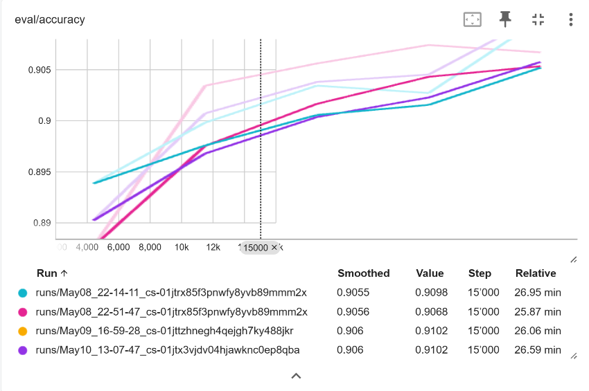

# Fashion-MNIST Clothing Classification

## Project Description
This project fine-tunes a Vision Transformer to classify Zalando’s Fashion-MNIST images into 10 clothing categories, and compares transfer-learning performance with a zero-shot CLIP model.

### Name & URL
| Name                   | URL                                                                                 |
|------------------------|-------------------------------------------------------------------------------------|
| Hugging Face Space     | [Granitagushi/vit-base-fashion demo](https://huggingface.co/spaces/Granitagushi/Clothing_Detector) |
| Model Page             | [Granitagushi/vit-base-fashion](https://github.com/granitagushi/AI_Project_fashion) |
| Code                   | [GitHub Repository](https://github.com/granitagushi/AI_Project_fashion)                                               |

## Labels
10 clothing items from Zalando:
[
    'T - shirt / top', 'Trouser', 'Pullover', 'Dress', 'Coat',
    'Sandal', 'Shirt', 'Sneaker', 'Bag', 'Ankle boot'
]

## Data Sources and Features Used Per Source

| Data Source                                                                                  | Description                                                                                                         |
|----------------------------------------------------------------------------------------------|---------------------------------------------------------------------------------------------------------------------|
| [Fashion-MNIST](https://huggingface.co/datasets/zalando-datasets/fashion_mnist)               | 70,000 front-look thumbnails from Zalando (originally 762×1000 JPEG), converted to 28×28 grayscale PNG; 60,000 train, 10,000 test |
| **Features**                                                                                 | **image** (PIL.Image, 28×28 px), **label** (integer 0–9 → 10 fashion classes)                                       |

## Data Augmentation

| Transformation                                            | Description                                                                             |
|-----------------------------------------------------------|-----------------------------------------------------------------------------------------|
| `Convert to RGB`                                          | Convert grayscale images to RGB (no change if already 3-channel)                        |
| `Resize to 224×224`                                       | Resize all images to height=224 and width=224                                           |
| `Resample=2 (BILINEAR)`                                   | Use bilinear interpolation when resizing                                                 |
| `Rescale factor=0.00392156862745098`                      | Scale pixel values from [0,255] to [0,1]                                                |
| `Normalize(mean=[0.5,0.5,0.5], std=[0.5,0.5,0.5])`        | Subtract mean and divide by std for each channel                                        |

## Model Training

### Data Splitting Method (Train/Validation/Test)
A total of 60,000 images from Fashion-MNIST were split as follows: 80% (48,000) for training, 10% (6,000) for validation, and 10% (6,000) for testing.

## Data Splits
| Split      | # Examples |
|------------|-----------:|
| Train      |     48,000 |
| Validation |      6,000 |
| Test       |      6,000 |

### Training & Validation Results
| Epoch | Train Loss | Val Loss | Val Accuracy |
|:-----:|-----------:|---------:|-------------:|
| 1     |     0.2888 |   0.2934 |       0.8917 |
| 2     |     0.3066 |   0.2694 |       0.9013 |
| 3     |     0.2722 |   0.2589 |       0.9042 |
| 4     |     0.2593 |   0.2576 |       0.9048 |
| 5     |     0.2422 |   0.2540 |       0.9078 |

### TensorBoard

Details of training can be found at [Huggingface TensorBoard](https://huggingface.co/Granitagushi/vit-base-fashion/tensorboard)

| Model/Method                                                         | TensorBoard Link                                      |
|----------------------------------------------------------------------|------------------------------------------------------|
| Transfer Learning with `google/vit-base-patch16-224` (without data augmentation) | runs/May08_21-55-49_cs-01jtrx85f3pnwfy8yvb89mmm2x                    |                   |

## Results

| Model/Method                                                      | Accuracy | Precision | Recall  |
|-------------------------------------------------------------------|---------:|----------:|--------:|
| Transfer learning (`vit-base-fashion`, no data augmentation)      |   0.9102 |      –    |     –   |
| Zero-shot CLIP (`openai/clip-vit-large-patch14`)                  |   0.6097 |   0.5647  |  0.6097 |

## References 

### Sample Prediction

### Predictions made by our ne model
