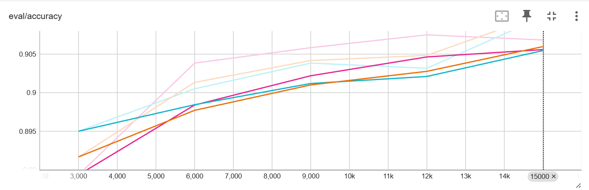

# Fashion-MNIST Clothing Classification

## Project Description
This project fine-tunes a Vision Transformer to classify Zalando’s Fashion-MNIST images into 10 clothing categories, and compares transfer-learning performance with a zero-shot CLIP model.

### Name & URL
| Name                   | URL                                                                                 |
|------------------------|-------------------------------------------------------------------------------------|
| Hugging Face Space     | [Granitagushi/vit-base-fashion demo](https://huggingface.co/spaces/Granitagushi/Clothing_Detector) |
| Model Page             | [Granitagushi/vit-base-fashion](https://huggingface.co/Granitagushi/vit-base-fashion) |
| Code                   | [GitHub Repository](https://github.com/granitagushi/AI_Project_fashion)                                               |

## Labels
10 clothing items from Zalando:
[
    'T - shirt / top', 'Trouser', 'Pullover', 'Dress', 'Coat',
    'Sandal', 'Shirt', 'Sneaker', 'Bag', 'Ankle boot'
]

## Data Sources and Features Used Per Source

| Data Source                                                                                  | Description                                                                                                         |
|----------------------------------------------------------------------------------------------|---------------------------------------------------------------------------------------------------------------------|
| [Fashion-MNIST](https://huggingface.co/datasets/zalando-datasets/fashion_mnist)               | 70,000 front-look thumbnails from Zalando (originally 762×1000 JPEG), converted to 28×28 grayscale PNG; 60,000 train, 10,000 test |
| **Features**                                                                                 | **image** (PIL.Image, 28×28 px), **label** (integer 0–9 → 10 fashion classes)                                       |

## Data Augmentation

| Transformation                                                  | Description                                                                                               |
|-----------------------------------------------------------------|-----------------------------------------------------------------------------------------------------------|
| `Resize to 256×256`                                             | Resize all input images to height=256 and width=256                                                       |
| `RandomResizedCrop(size=224, scale=(0.85, 1.0))`               | Randomly crop a 224×224 patch from the image, scaling the crop area between 85 % – 100 % of the original   |
| `RandomHorizontalFlip(p=0.5)`                                   | Horizontally flip each image with 50 % probability                                                         |
| `ColorJitter(brightness=0.2, contrast=0.2)`                     | Apply random adjustments to brightness (±20 %) and contrast (±20 %)                                       |
| `RandomRotation(degrees=5)`                                     | Rotate the image randomly by up to ±5 degrees                                                              |

## Model Training

### Data Splitting Method (Train/Validation/Test)
A total of 60,000 images from Fashion-MNIST were split as follows: 80% (48,000) for training, 10% (6,000) for validation, and 10% (6,000) for testing.

## Data Splits
| Split      | # Examples |
|------------|-----------:|
| Train      |     48,000 |
| Validation |      6,000 |
| Test       |      6,000 |

### Training & Validation Results
| Epoch | Train Loss | Val Loss | Val Accuracy |
|:-----:|-----------:|---------:|-------------:|
| 1     |     0.2888 |   0.2934 |       0.8917 |
| 2     |     0.3066 |   0.2694 |       0.9013 |
| 3     |     0.2722 |   0.2589 |       0.9042 |
| 4     |     0.2593 |   0.2576 |       0.9048 |
| 5     |     0.2422 |   0.2540 |       0.9078 |

### TensorBoard

Details of training can be found at [Huggingface TensorBoard](https://huggingface.co/Granitagushi/vit-base-fashion/tensorboard)

| Model/Method                                                         | TensorBoard Link                                      |
|----------------------------------------------------------------------|------------------------------------------------------|
| Transfer Learning with `google/vit-base-patch16-224` (without data augmentation) | runs/May12_20-06-38_cs-01jv30w57s3x5787jt7sj65b8z                    |                   |
| Transfer Learning with `google/vit-base-patch16-224` (with data augmentation)  | runs/May31_21-14-43_cs-01jwm0rvrk5b2m7f3e2trkqfjc                    |

## Results
| Model/Method                                                         | Accuracy | Precision | Recall |
|----------------------------------------------------------------------|----------|-----------|--------|
| Transfer Learning with `google/vit-base-patch16-224` (without data augmentation) | 91.02%      | -         | -      |
| Transfer Learning with `google/vit-base-patch16-224` (with data augmentation)  | 91.02%      | -         | -      |
| Zero-shot Image Classification with `openai/clip-vit-large-patch14`  | 60.97%      | 56.47%    | 60.97%    |

## References 

### Example images from dataset

### Predictions made by our new model
